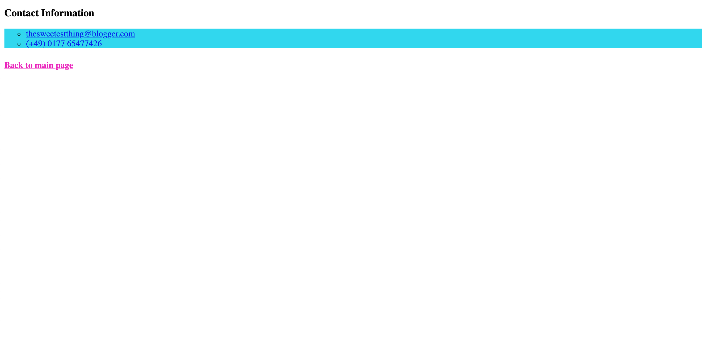

# Der Sweet Spot

Erstelle die Webseite wie im Referenzbild unten gezeigt.

### Anweisungen

> - Verwende http://www.cupcakeipsum.com/ für den Dummy text.
> - Verwende Hex-Codes, um die Farben so genau wie möglich nachzubilden.
> - Verwende Klassen, IDs und CSS-Selektoren, wo es angebracht ist.
> - Du musst die Pseudoklassen `:hover`, `:active` und `:visited` verwenden
> - Der Text unter den beiden **Untertopic**-Überschriften ändert seine Farbe bei `:hover`.
> - Die Links am unteren Ende der Hauptseite und unter **Kontaktinformationen** sind in Listenform und ändern ihre Farbe bei `:hover`.
> - Die Weblinks haben die Klasse `:active` und sollten in einem neuen Tab geöffnet werden
> - Die Pseudo-Klassen "visited" sollten auf die internen Links **Drop me a line!** und **Back to main page** angewendet werden

#### Hauptseite

#### Kontakt Seite

### Als weitere Referenz kannst du dir die Live-Version [hier!](https://digitalcareerinstitute.github.io/UIB-content-the-sweet-spot/index.html) ansehen
